# ramalama-lab — run local LLMs without the headache

A systematic exploration of **RamaLama 0.18.0**: pull, run, benchmark, and serve AI models locally.

**Tested on:** Windows 11 + WSL2 Ubuntu 24.04, 4 GB RAM cap, AMD Ryzen 7 4700U, no GPU.

---

## Quick start

```bash
pip install ramalama --break-system-packages
ramalama pull ollama://tinyllama
ramalama run ollama://tinyllama "What are the Four Foundations of the Fedora project?"
```

> Ubuntu 24.04 users: fix the Podman registry config before anything else — see Step 1.

---

## What you need

- Windows 11 with WSL2 (or native Linux)
- Ubuntu 24.04 LTS
- Python 3.12+
- Podman 4.9.3+
- ~4 GB RAM (the more the better)

**WSL2 `.wslconfig` used:**

```ini
[wsl2]
memory=4GB
processors=4
swap=2GB
```

The 4 GB cap leaves ~3.4 GB actually available after VM overhead and WSL2 internal processes.

---

## WSL2 Setup (Windows only)

```powershell
dism.exe /online /enable-feature /featurename:VirtualMachinePlatform /all /norestart
dism.exe /online /enable-feature /featurename:Microsoft-Windows-Subsystem-Linux /all /norestart
shutdown /r /t 0
```

After reboot:

```powershell
wsl --install -d Ubuntu-24.04
wsl --set-default Ubuntu-24.04
```

---

## Step 1: Install dependencies

```bash
sudo apt update && sudo apt upgrade -y
sudo apt install -y python3 python3-pip python3-venv podman
```

```bash
podman --version
```

```
podman version 4.9.3
```

**Fix Ubuntu 24.04 Podman registry bug:**

Ubuntu 24.04's default Podman package ships with a `registries.conf` that mixes old V1 and new V2 format entries. Podman refuses to parse it in that state. Rewrite it as clean V2 TOML:

```bash
sudo cp /etc/containers/registries.conf /etc/containers/registries.conf.bak
sudo tee /etc/containers/registries.conf << 'EOF'
unqualified-search-registries = ["docker.io", "quay.io"]
EOF
```

Verify:

```bash
podman run --rm docker.io/library/hello-world
```

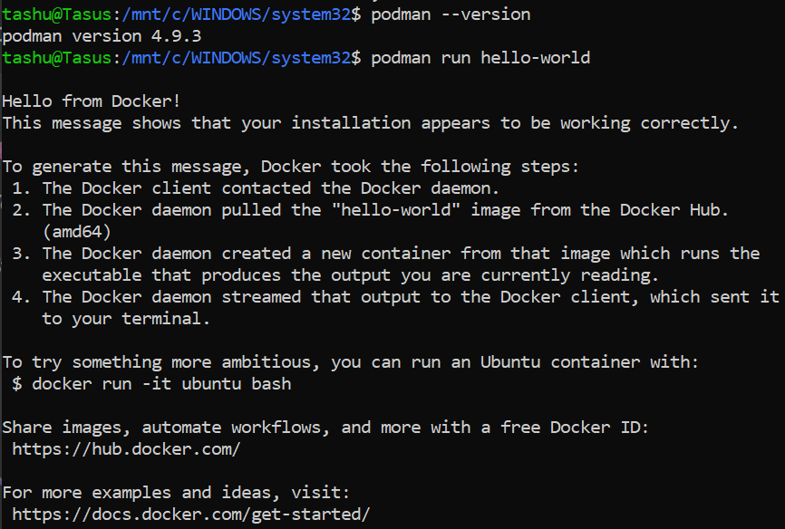

---

## Step 2: Install RamaLama

```bash
pip install ramalama --break-system-packages
```

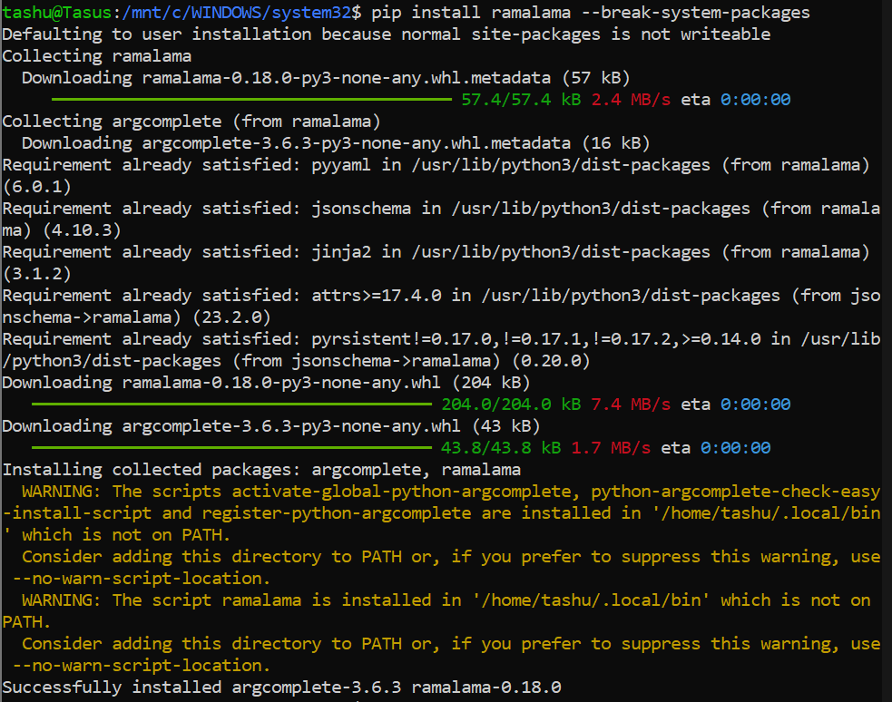

Fix PATH:

```bash
echo 'export PATH="$HOME/.local/bin:$PATH"' >> ~/.bashrc && source ~/.bashrc
```

---

## Step 3: Verify install

```bash
ramalama version
```

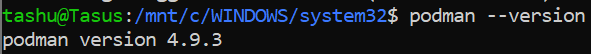

```bash
ramalama info
```

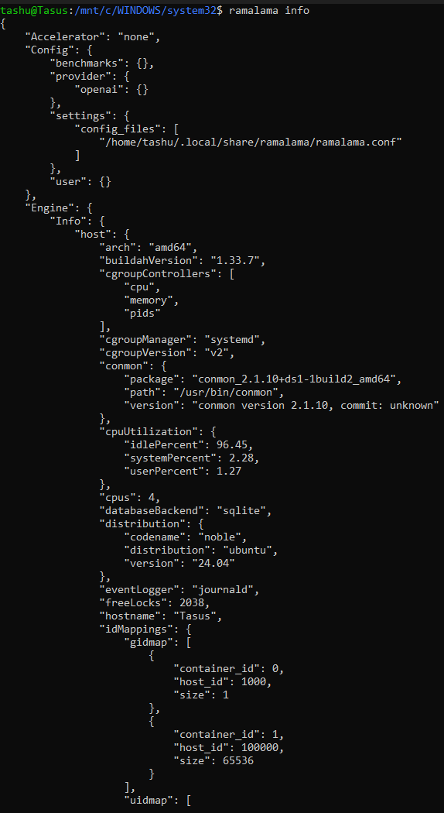

Key fields from the JSON output:
```json
{
  "Accelerator": "none",
  "Engine": { "Version": { "Version": "4.9.3" } },
  "RagImage": "quay.io/ramalama/ramalama-rag:0.18",
  "UseContainer": true
}
```

---

## Step 4: Pull and run first model — Ollama transport

Dryrun (shows the full Podman command without executing):

```bash
ramalama --dryrun run ollama://tinyllama "What are the Four Foundations of the Fedora project?"
```

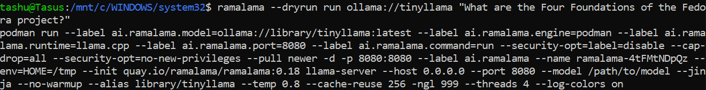

Pull:

```bash
ramalama pull ollama://tinyllama
```

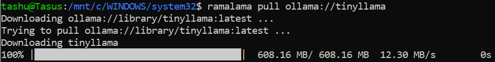

List:

```bash
ramalama list
```

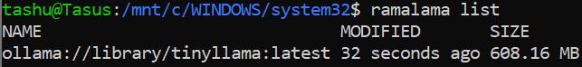

Run:

```bash
ramalama run ollama://tinyllama "What are the Four Foundations of the Fedora project?"
```

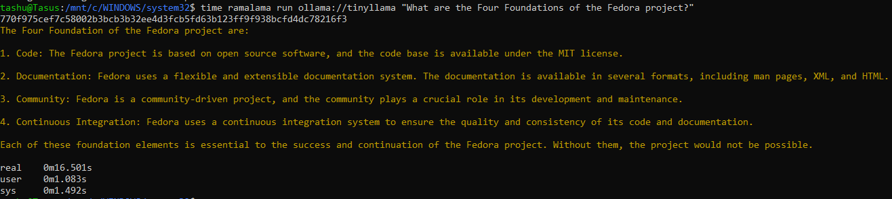

> Actual Four Foundations: Freedom, Friends, Features, First. TinyLlama got zero of the four right, it hallucinated. But, outputs vary across runs.

`--nocontainer` test:

```bash
ramalama --nocontainer run ollama://tinyllama "test"
```

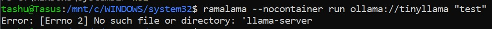

---

## Step 5: Different transport — HuggingFace

Pull:

```bash
ramalama pull huggingface://TheBloke/TinyLlama-1.1B-Chat-v1.0-GGUF/tinyllama-1.1b-chat-v1.0.Q4_K_M.gguf
```

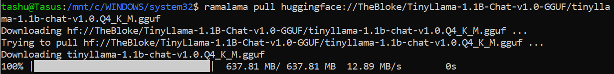

List both models:

```bash
ramalama list
```

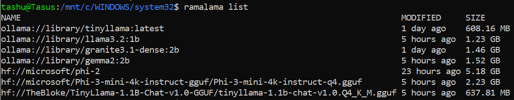

Run same prompt:

```bash
ramalama run huggingface://TheBloke/TinyLlama-1.1B-Chat-v1.0-GGUF/tinyllama-1.1b-chat-v1.0.Q4_K_M.gguf \
  "What are the Four Foundations of the Fedora project?"
```

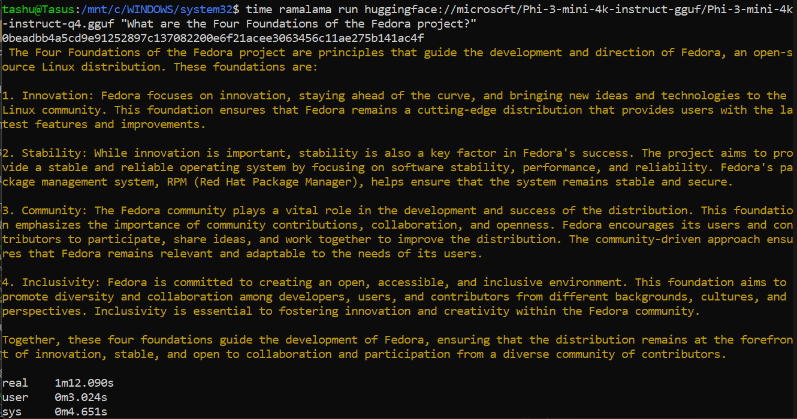

> Same model weights, completely different answer — different chat template packaging between the two registries.

---

## Step 6: Transport comparison

| Transport   | Command                                                                         | Size     | WSL2        |
|-------------|---------------------------------------------------------------------------------|----------|-------------|
| Ollama      | `ramalama pull ollama://tinyllama`                                              | 608 MB   | ✅          |
| HuggingFace | `ramalama pull huggingface://TheBloke/TinyLlama.../tinyllama...Q4_K_M.gguf`    | 638 MB   | ✅          |
| OCI         | `ramalama pull oci://quay.io/ramalama/ramalama:latest`                         | 5.18 GB¹ | ❌ run fails² |

¹ `oci://quay.io/ramalama/ramalama:latest` is the RamaLama runtime container image (llama.cpp + all inference dependencies), not an OCI-packaged model. OCI transport is designed for OCI-packaged model images; this URI was used to test the transport mechanism itself.  
² OCI transport uses subpath volume mounts to expose the model inside the container. WSL2's kernel (6.6.87.2-microsoft-standard-WSL2) does not support that mount type — this is a WSL2 kernel limitation, not a RamaLama bug.

```bash
ramalama run oci://quay.io/ramalama/ramalama:latest
```

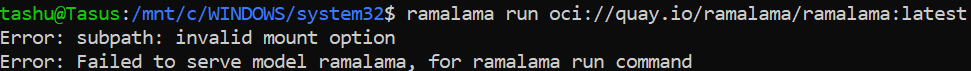

---

## Step 7: Granite 3.1 — context window fix

| Command                                                       | Result             |
|---------------------------------------------------------------|--------------------|
| `ramalama pull ollama://granite3.1-dense:2b`                  | Pulled 1.46 GB  |
| `ramalama run ollama://granite3.1-dense:2b`                   | Timeout at 180s |
| `ramalama run --ctx-size 512 ollama://granite3.1-dense:2b`    | Runs            |

**Why the default fails:** Allocating the KV cache for the default context window on top of 1.46 GB of model weights exceeds available RAM. During the timeout, free memory was bouncing between 0.8 and 1.7 GB.

**Fix:** `--ctx-size 512` caps the context window, reducing KV cache size and bringing total memory within range.

```bash
ramalama run --ctx-size 512 ollama://granite3.1-dense:2b "What are the Four Foundations of Fedora?"
```

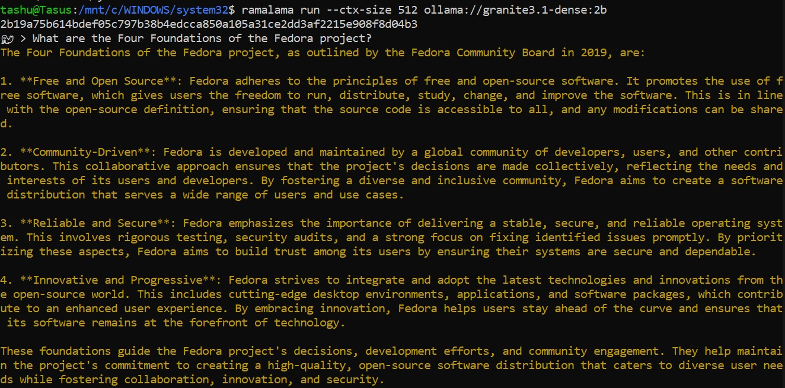

---

## Step 8: Benchmark results (CPU-only, 4 threads)

`ramalama bench` was run separately for each model. Representative command:

```bash
ramalama bench ollama://tinyllama
```

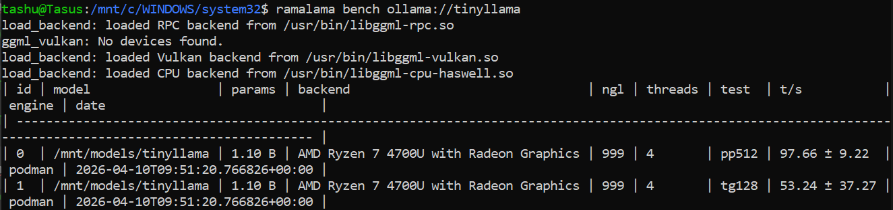

| Model              | Params | Size    | pp512 (t/s) | tg128 (t/s) |
|--------------------|--------|---------|-------------|-------------|
| HF TinyLlama       | 1.10B  | 638 MB  | 119.25      | 36.05       |
| Ollama TinyLlama   | 1.10B  | 608 MB  | 97.66       | 53.24       |
| Llama 3.2:1b       | ~1B    | 1.23 GB | 95.71       | 20.55       |
| Gemma2 2B          | 2.61B  | 1.52 GB | 41.46       | 13.59       |
| Granite 3.1-dense  | 2.53B  | 1.46 GB | 38.15       | 15.22       |
| Phi-2              | 2.78B  | 1.67 GB | 32.78       | 13.01       |
| Phi-3-mini         | 3.82B  | 2.23 GB | 23.48       | 9.93        |

> tg128 for Ollama TinyLlama shows ±37.27 std dev (70% of mean) — likely CPU thermal throttling under sustained load. Treat as directional.

---

## Step 9: REST API mode

Terminal 1 — start server:

```bash
ramalama serve ollama://tinyllama --port 8080
```


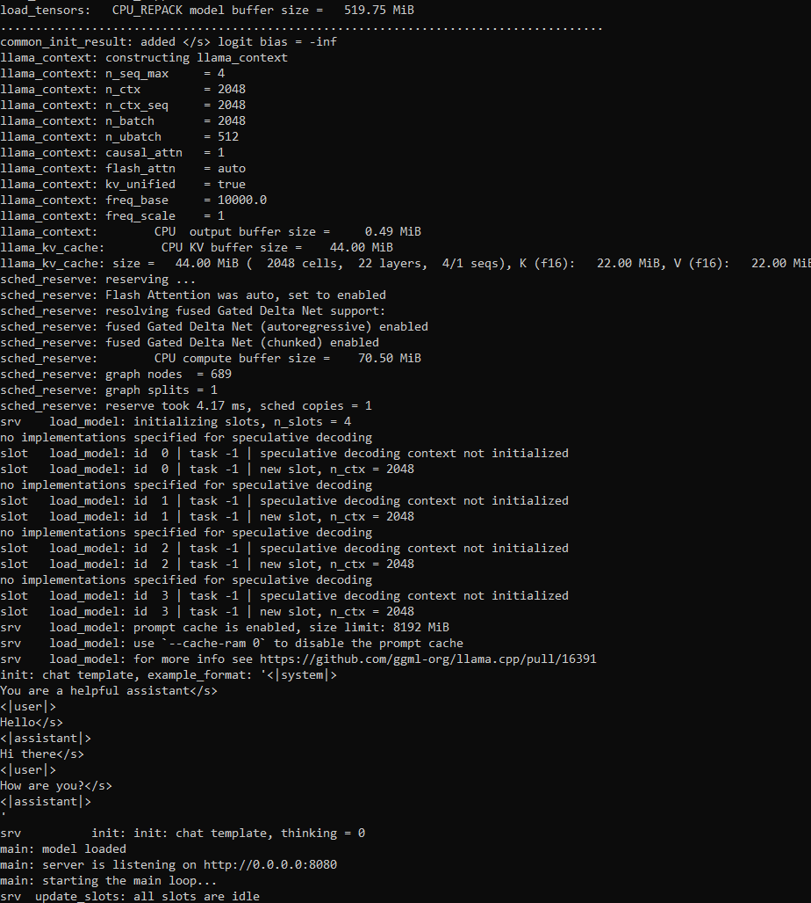

```
main: server is listening on http://0.0.0.0:8080
```

Terminal 2 — query:

```bash
curl http://127.0.0.1:8080/v1/chat/completions \
  -H 'Content-Type: application/json' \
  -d '{"model":"tinyllama","messages":[{"role":"user","content":"What is Fedora?"}]}'
```

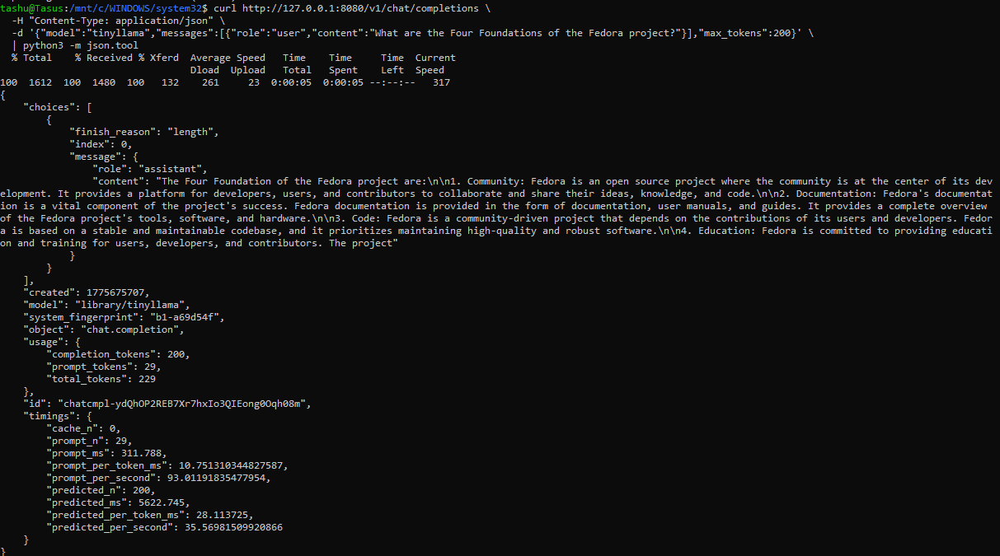

> OpenAI-compatible endpoint. Works with LangChain, llama_index, or any client that speaks the OpenAI chat completions API — just swap the base URL to `localhost`.

---

## Command reference

| Command                                                   | Purpose                        |
|-----------------------------------------------------------|--------------------------------|
| `ramalama version`                                        | Verify install                 |
| `ramalama info`                                           | System report                  |
| `ramalama pull ollama://tinyllama`                        | Download model                 |
| `ramalama list`                                           | Show downloaded models         |
| `ramalama inspect ollama://tinyllama`                     | Show model metadata            |
| `ramalama run ollama://tinyllama "prompt"`                | One-shot query                 |
| `ramalama run --ctx-size 512 ollama://model`              | Cap context window             |
| `ramalama serve ollama://tinyllama --port 8080`           | Start API server               |
| `ramalama bench ollama://tinyllama`                       | Run benchmark                  |
| `ramalama containers`                                     | List containers                |
| `ramalama rm ollama://tinyllama`                          | Delete model                   |
| `ramalama --dryrun run ollama://tinyllama "prompt"`       | Show full Podman command       |

---

## Memory reference

| Model                              | Approx. consumed | Swap  | Result         |
|------------------------------------|------------------|-------|----------------|
| TinyLlama (608 MB)                 | ~2.2 GB          | 0B    | Comfortable |
| Phi-3-mini (2.23 GB)               | Moderate overhead| 74 MB | Works       |
| Granite (1.46 GB + default context)| Exceeds headroom | 0B    | Fails       |
| Granite (1.46 GB + --ctx-size 512) | Fits             | 0B    | Works       |

Memory is reclaimed after container exit — no leaks observed.

---

## Further reading

[BLOG](https://akriti-sengar.hashnode.dev/making-ai-boring-what-i-learned-setting-up-ramalama) — full narrative, failures, debugging journey, and why this makes AI boring
